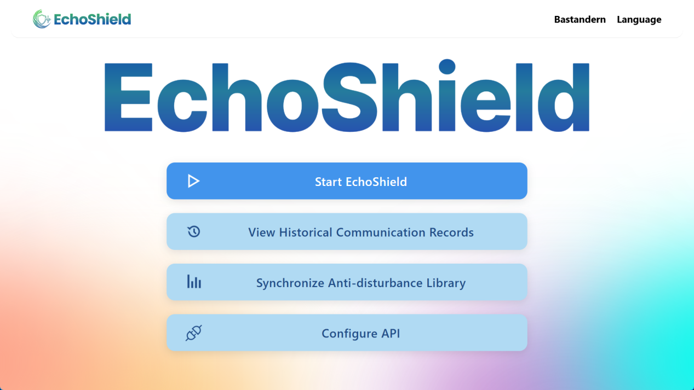
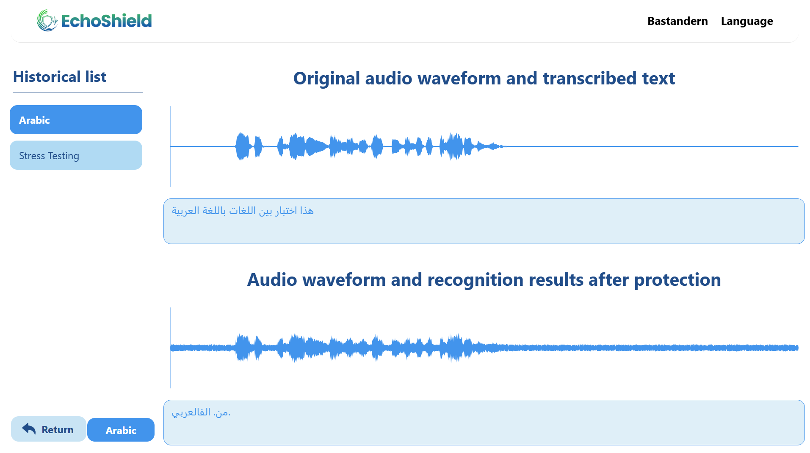
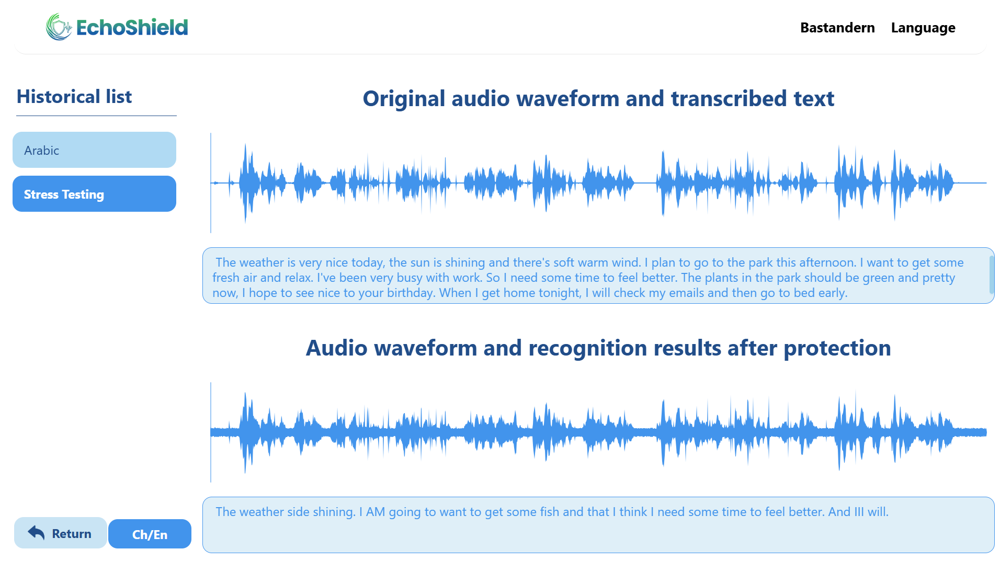

<div align="center">


<p>
  <strong>English</strong> | <a href="./README.zh-CN.md">简体中文</a>
</p>

</div>

**EchoShield** is a cross-platform desktop application designed to protect your voice privacy in real-time. By introducing controlled perturbations into microphone input, it effectively prevents automatic speech recognition (ASR) systems from understanding your conversations while maintaining natural human communication. 🚀

## 🎯 What Problem Does It Solve?

Modern devices and applications continuously listen for voice commands, raising serious privacy concerns. EchoShield addresses this by adding inaudible noise to your voice, making it incomprehensible to ASR systems while remaining perfectly understandable to humans sitting next to you.

**Use Cases:**
- Prevent smart assistants from eavesdropping on private conversations
- Protect sensitive information during video calls
- Block voice-activated malware and spyware
- Maintain privacy in open office environments

## ✨ Features

### Core Features
- **🎤 Real-time Audio Protection**: Continuously capture and process microphone input with adversarial perturbations
- **👁️ Visual Waveform Display**: See both original and protected audio waveforms in real-time
- **🔊 Normal Communication**: Protected audio remains understandable to nearby humans
- **🎚️ Adjustable Perturbation Intensity**: Control the strength of protection (0.0 - 1.0)

### Recording & Playback
- **📁 Audio Recording**: Save protected audio sessions for later review
- **🔄 A/B Comparison**: Compare original vs. protected audio side-by-side
- **▶️ Playback Controls**: Play/pause/stop protected audio output
- **📋 Recording History**: Browse and manage past recordings

### Speech Recognition (ASR)
- **🗣️ Speech-to-Text**: Automatic transcription of audio (requires iFlytek API)
- **📊 Dual Transcription**: Compare transcriptions of original vs. protected audio
- **🌍 Multi-language Support**: Chinese, English, Japanese, French, German, Spanish, Arabic

### Perturbation Library
- **📥 Remote Sync**: Download latest perturbation vectors from GitHub
- **📤 Manual Upload**: Import custom perturbation files (.ar format)
- **🔐 Local Storage**: Perturbation files stored securely in user data directory

### User Management
- **🔑 User Registration/Login**: Secure local account system
- **👤 Per-user Storage**: Each user has isolated audio files and settings

## 📸 Screenshots

### Main Dashboard


### Recording History - Original vs Protected



## 🚀 Getting Started

### Prerequisites
- [Node.js](https://nodejs.org/) v14 or higher
- [Rust](https://www.rust-lang.org/) (for Tauri development)
- [pnpm](https://pnpm.io/) - Fast package manager
- A working microphone
- A virtual audio cable (e.g., "Virtual Audio Cable") for audio routing

### Installation

1. Clone the repository:
   ```bash
   git clone https://github.com/Bastandern/EchoShield.git
   cd EchoShield
   ```

2. Install dependencies:
   ```bash
   pnpm install
   ```

3. Run in development mode:
   ```bash
   pnpm tauri dev
   ```

4. Build for production:
   ```bash
   pnpm tauri build
   ```

### Quick Start

1. **Register/Login**: Create a local account on first launch
2. **Sync Perturbation**: Go to "Async" to download the latest perturbation library
3. **Start Protection**: Click "Start" to begin real-time audio protection
4. **Toggle Audio**: Click play button to enable/disable protected audio output

## 🛠️ Architecture

```
┌─────────────────────────────────────────────────────────────┐
│                      EchoShield App                          │
├─────────────────────────────────────────────────────────────┤
│  Frontend (Vue.js)                                          │
│  ├── HomeView      - Main dashboard                         │
│  ├── ProtectView   - Real-time protection & waveforms       │
│  ├── ListView      - Recording history & ASR comparison     │
│  ├── ConfigView    - API configuration                      │
│  └── AsyncView     - Perturbation sync                      │
├─────────────────────────────────────────────────────────────┤
│  Backend (Rust + Tauri)                                     │
│  ├── Audio Capture   - Microphone input (CPAL)              │
│  ├── Audio Processing - Add perturbations                   │
│  ├── Audio Output   - Virtual audio device output           │
│  └── Database       - SQLite for user & file management     │
└─────────────────────────────────────────────────────────────┘
```

## 🔧 Configuration

### iFlytek ASR API Setup (Optional)

To enable speech-to-text transcription:

1. Register at [iFlytek Open Platform](https://console.xfyun.cn/)
2. Create an "Intelligent Speech Recognition" application
3. Get your `AppID`, `API Key`, and `API Secret`
4. Enter credentials in Settings → Config

### Audio Routing

For best results with protected audio output:
1. Install "Virtual Audio Cable" or similar software
2. Set Virtual Audio Cable as your output device
3. Configure your communication app to use Virtual Audio Cable as input

## 📁 Data Storage

Audio files are stored in:
- **Windows**: `%APPDATA%\top.echoshield\`
- **macOS**: `~/Library/Application Support/top.echoshield/`
- **Linux**: `~/.local/share/top.echoshield/`

Files include:
- `echoshield.db` - User database
- `uap/uap.ar` - Perturbation library
- `waves/*.wav` - Recorded audio files
- `waves/*.txt` - Transcription results

## 🛠️ Technologies

- **[Tauri](https://tauri.app/)** - Cross-platform desktop framework
- **[Vue.js 3](https://vuejs.org/)** - Progressive frontend framework
- **[Rust](https://www.rust-lang.org/)** - High-performance backend
- **[CPAL](https://github.com/rust-audio/cpal)** - Cross-platform audio I/O
- **[SQLite](https://www.sqlite.org/)** - Lightweight database
- **[WaveSurfer.js](https://wavesurfer-js.org/)** - Audio visualization

## 📄 License

This project is licensed under the MIT License.

## 📫 Contact

- Email: 624772990@qq.com
- GitHub Issues: [Open an issue](https://github.com/Bastandern/EchoShield/issues)

## ✨ Acknowledgments

- Perturbation library sourced from [Bastandern/ar](https://github.com/Bastandern/ar)
- Thanks to the open-source community for making this project possible
