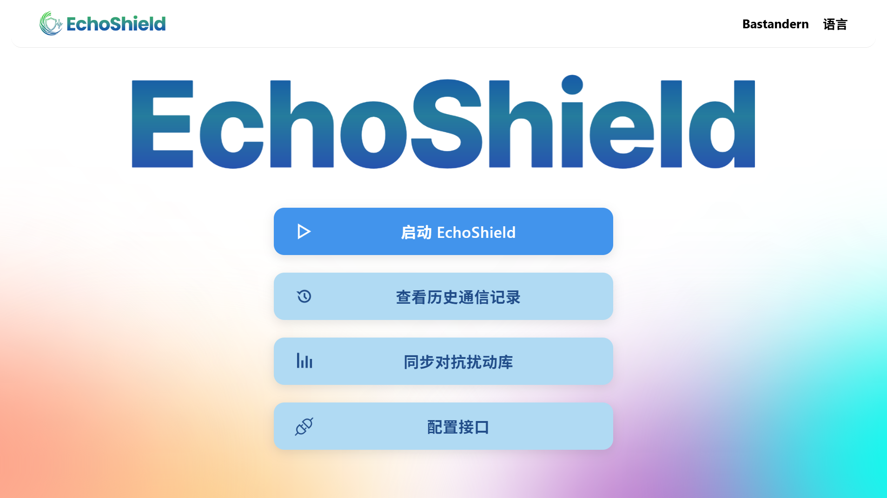
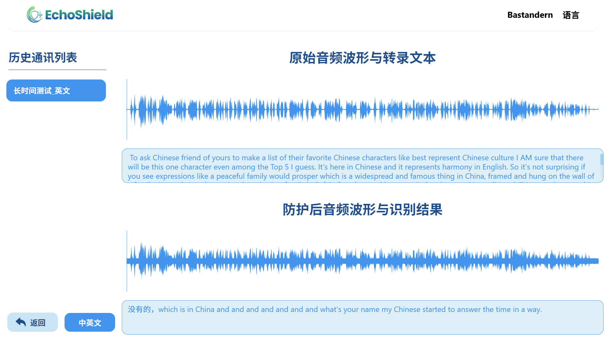
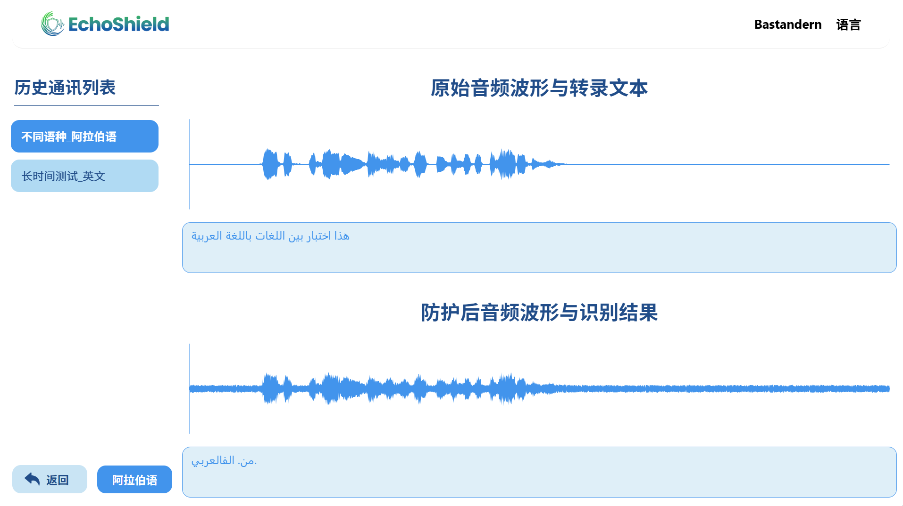

<div align="center">


<p>
  <a href="./README.md">English</a> | <strong>简体中文</strong>
</p>

</div>

**EchoShield** 是一款跨平台桌面应用程序，旨在实时保护您的语音隐私。通过向麦克风输入添加可控的对抗扰动，它可以有效阻止自动语音识别（ASR）系统理解您的对话内容，同时保持人类正常交流。🚀

## 🎯 它解决什么问题？

现代设备和应用持续监听语音命令，引发严重的隐私担忧。EchoShield 通过向您的语音添加人耳几乎无法感知的噪声来解决这一问题，使 ASR 系统无法识别，但坐在您旁边的人仍然可以正常理解。

**应用场景：**
- 防止智能助手窃听私人对话
- 在视频通话中保护敏感信息
- 阻止语音激活的恶意软件和间谍软件
- 在开放办公环境中维护隐私

## ✨ 功能特点

### 核心功能
- **🎤 实时音频保护**：持续捕获麦克风输入并添加对抗扰动
- **👁️ 可视化波形显示**：实时查看原始音频和保护后音频的波形
- **🔊 正常交流**：保护后的音频对附近的人仍然可以理解
- **🎚️ 可调扰动强度**：控制保护强度（0.0 - 1.0）

### 录音与播放
- **📁 音频录制**：保存保护后的音频会话供后续回顾
- **🔄 A/B 对比**：并排比较原始音频与保护后音频
- **▶️ 播放控制**：播放/暂停/停止保护后的音频输出
- **📋 录音历史**：浏览和管理历史录音

### 语音识别（ASR）
- **🗣️ 语音转文字**：自动转录音频（需要配置讯飞 API）
- **📊 双语转录对比**：对比原始音频与保护后音频的转录结果
- **🌍 多语言支持**：中文、英语、日语、法语、德语、西班牙语、阿拉伯语

### 扰动库管理
- **📥 远程同步**：从 GitHub 下载最新的扰动向量
- **📤 手动上传**：导入自定义扰动文件（.ar 格式）
- **🔐 本地存储**：扰动文件安全存储在用户数据目录

### 用户管理
- **🔑 用户注册/登录**：安全的本地账户系统
- **👤 分用户存储**：每个用户拥有独立的音频文件和个人设置

## 📸 截图

### 主控制面板


### 录音历史 - 原始音频与防护后音频



## 🚀 快速开始

### 环境要求
- [Node.js](https://nodejs.org/) v14 或更高版本
- [Rust](https://www.rust-lang.org/)（用于 Tauri 开发）
- [pnpm](https://pnpm.io/) - 高效的包管理器
- 可正常工作的麦克风
- 虚拟声卡（如 "Virtual Audio Cable"）用于音频路由

### 安装步骤

1. 克隆仓库：
   ```bash
   git clone https://github.com/Bastandern/EchoShield.git
   cd EchoShield
   ```

2. 安装依赖：
   ```bash
   pnpm install
   ```

3. 开发模式运行：
   ```bash
   pnpm tauri dev
   ```

4. 构建生产版本：
   ```bash
   pnpm tauri build
   ```

### 快速上手

1. **注册/登录**：首次启动时创建本地账户
2. **同步扰动库**：进入"异步"页面下载最新的扰动库
3. **开始保护**：点击"启动"开始实时音频保护
4. **切换音频**：点击播放按钮启用/禁用保护后音频输出

## 🛠️ 系统架构

```
┌─────────────────────────────────────────────────────────────┐
│                      EchoShield 应用程序                     │
├─────────────────────────────────────────────────────────────┤
│  前端 (Vue.js)                                              │
│  ├── HomeView      - 主控制面板                              │
│  ├── ProtectView   - 实时保护与波形显示                       │
│  ├── ListView      - 录音历史与 ASR 对比                     │
│  ├── ConfigView    - API 配置                               │
│  └── AsyncView     - 扰动库同步                              │
├─────────────────────────────────────────────────────────────┤
│  后端 (Rust + Tauri)                                         │
│  ├── 音频捕获      - 麦克风输入 (CPAL)                        │
│  ├── 音频处理      - 添加扰动                                 │
│  ├── 音频输出      - 虚拟音频设备输出                         │
│  └── 数据库        - SQLite 用户与文件管理                    │
└─────────────────────────────────────────────────────────────┘
```

## 🔧 配置说明

### 讯飞 ASR API 配置（可选）

启用语音转文字功能：

1. 在 [讯飞开放平台](https://console.xfyun.cn/) 注册账号
2. 创建“智能语音识别”应用
3. 获取您的 `AppID`、`API Key` 和 `API Secret`
4. 在设置 → 配置中填入凭证

### 音频路由配置

获得最佳的保护音频输出效果：
1. 安装 "Virtual Audio Cable" 或类似软件
2. 将虚拟声卡设置为您的输出设备
3. 将您的通讯应用配置为使用虚拟声卡作为输入

## 📁 数据存储

音频文件存储位置：
- **Windows**：`%APPDATA%\top.echoshield\`
- **macOS**：`~/Library/Application Support/top.echoshield/`
- **Linux**：`~/.local/share/top.echoshield/`

文件包括：
- `echoshield.db` - 用户数据库
- `uap/uap.ar` - 扰动库文件
- `waves/*.wav` - 录制的音频文件
- `waves/*.txt` - 转录结果文件

## 🛠️ 技术栈

- **[Tauri](https://tauri.app/)** - 跨平台桌面应用框架
- **[Vue.js 3](https://vuejs.org/)** - 渐进式前端框架
- **[Rust](https://www.rust-lang.org/)** - 高性能后端语言
- **[CPAL](https://github.com/rust-audio/cpal)** - 跨平台音频 I/O
- **[SQLite](https://www.sqlite.org/)** - 轻量级数据库
- **[WaveSurfer.js](https://wavesurfer-js.org/)** - 音频可视化

## 📄 开源协议

本项目基于 MIT 协议开源。

## 📫 联系方式

- 邮箱：624772990@qq.com
- GitHub Issues：[提交问题](https://github.com/Bastandern/EchoShield/issues)